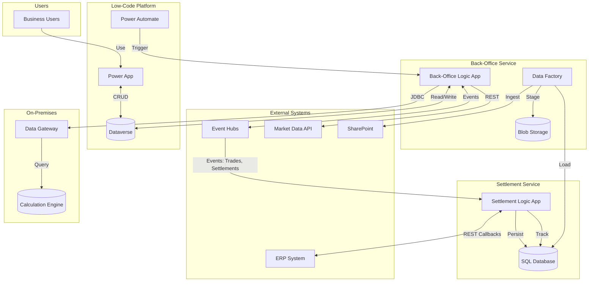

---
sidebar_position: 1
title: "Energy Trading Settlement Platform"
description: "Hybrid cloud architecture for automated settlement and back-office integration in energy commodity trading"
---

# Energy Trading Settlement Platform

## Overview

The Solution addresses the need for an **automated settlement and back-office integration platform** within a large energy corporation's trading division. The platform ingests real-time trading data from multiple upstream systems — including an enterprise trading platform, market data providers, and ERP systems — processes settlement calculations, and synchronizes results with a user-facing low-code front-end.

The architecture follows a **hybrid cloud pattern** on Microsoft Azure, combining PaaS services for orchestration and data processing with on-premises connectivity for legacy database systems. The design prioritizes security through network isolation (private endpoints, VNet integration), Azure AD-only authentication, and managed identities to eliminate stored credentials in application configurations.

The Architect's work encompassed the full infrastructure design, multi-environment Terraform IaC, CI/CD pipeline architecture, security model, and the integration patterns connecting six distinct systems through event-driven and API-based communication.

## Architecture Pattern

The solution uses a **hybrid event-driven integration architecture** with two distinct service domains:

1. **Settlement Integrated Service** — handles real-time event ingestion from the trading platform via Event Hubs, persists settlement data into a relational database, and manages bi-directional communication with the ERP system.
2. **Back-Office Integration Service** — orchestrates data flows between external market data systems, on-premises calculation engines, and the low-code front-end platform.

This separation was chosen to isolate the high-throughput, event-driven settlement flows from the API/batch-oriented back-office integrations, allowing independent scaling and deployment.

## Components

### Low-Code Front-End (Power Platform)
- **Role**: Business user interface for settlement operations, data visualization, and workflow initiation
- **Technology**: Microsoft Power Apps (model-driven app) + Power Automate
- **Interfaces**: Reads/writes to Dataverse; triggers back-end workflows; sends email notifications via Outlook connector

### Settlement Logic App
- **Role**: Core settlement orchestration — ingests trading events, persists to database, manages ERP integration flows
- **Technology**: Azure Logic App (Standard, .NET runtime)
- **Interfaces**:
  - Consumes events from Event Hub (multiple topics: net statements, orders, trade desk data)
  - Writes to Azure SQL Database (settlement tables, synchronization tracking, data flow dashboard)
  - Exposes HTTP endpoints for ERP callbacks (with Bearer token validation)
  - Tracks data flow lineage via a dashboard table

### Back-Office Logic App
- **Role**: Orchestrates integration between external data sources and the front-end platform
- **Technology**: Azure Logic App (Standard, .NET runtime)
- **Interfaces**:
  - Reads/writes to Dataverse via managed API connection (Managed Identity auth)
  - Connects to on-premises calculation engine via JDBC (Oracle)
  - Calls external market data REST API for commodity price feeds
  - Consumes/produces Event Hub messages

### Azure SQL Database
- **Role**: Primary data store for settlement records, synchronization state, and operational data
- **Technology**: Azure SQL Database (Serverless, Gen5, auto-pause enabled)
- **Interfaces**: Private endpoint only; Azure AD authentication only (no SQL auth); accessed by Logic Apps via SQL connector and by Data Factory via managed identity

### Azure Blob Storage
- **Role**: File-based data staging for data factory pipelines and document storage
- **Technology**: Azure Storage Account (Hot tier, LRS, private endpoints for blob and table)
- **Interfaces**: Accessed by Data Factory (managed identity, Storage Blob Data Contributor role); private endpoint only

### Azure Data Factory
- **Role**: Batch data movement and transformation — ingests data from SharePoint and other file sources, loads into SQL and Blob Storage
- **Technology**: Azure Data Factory with managed private endpoints
- **Interfaces**: SharePoint linked service (service principal auth); SQL and Blob Storage (managed identity); scheduled triggers (10-min intervals)

### Event Hubs
- **Role**: Real-time event streaming layer for trading platform data
- **Technology**: Azure Event Hubs
- **Interfaces**: Multiple topics for different data domains (net statements, orders, trade desk); consumed by Settlement Logic App via managed API connection

### On-Premises Calculation Engine
- **Role**: Legacy system performing complex commodity calculation models
- **Technology**: Oracle Database (on-premises)
- **Interfaces**: Accessed from Azure via On-Premises Data Gateway; JDBC connection from Back-Office Logic App

### External Market Data API
- **Role**: Provides real-time and historical commodity market prices (day-ahead, weekend, bid/ask)
- **Technology**: External REST API
- **Interfaces**: Called by Back-Office Logic App; returns price data for multiple commodity indices

## Interactions & Data Flow

### Key Data Flows

1. **Trading Event Ingestion**: Trading platform → Event Hubs → Settlement Logic App → SQL Database (settlement records + sync tracking)
2. **ERP Bi-directional Flow**: ERP sends orders via HTTP → Logic App persists and processes → Logic App sends response back via HTTP callback
3. **Market Data Enrichment**: Back-Office Logic App → External Market Data API → Dataverse (prices for front-end display)
4. **On-Premises Calculation**: Back-Office Logic App → Data Gateway → Oracle DB → Results back to Dataverse
5. **Document Ingestion**: SharePoint → Data Factory → Blob Storage / SQL Database
6. **Front-End Sync**: Power App ↔ Dataverse ↔ Back-Office Logic App

## Infrastructure Design

### Environments
The solution runs across **four environments** with identical topology:
- **Development** (dev)
- **Test** (test)
- **Pre-Production** (quality)
- **Production** (prod)

### Network Architecture
- All data services (SQL, Storage) are deployed with **private endpoints** in dedicated subnets within a project-scoped VNet
- VNet is part of a hub-spoke topology with centralized DNS resolution and firewall routing (UDR routes to hub firewall)
- On-premises connectivity via **On-Premises Data Gateway** for Oracle access
- Logic Apps use **VNet integration**
- Data Factory uses **managed private endpoints** for SQL and Blob Storage connections
- Storage firewall denies public access; allowlisted subnets only (specific platform subnets)

### Compute Strategy
- **Serverless SQL Database** (Gen5, 2 vCores) with auto-pause at 60 minutes — optimized for cost given intermittent workload patterns
- **Logic Apps Standard** — consumption-based with .NET runtime
- **Data Factory** — pay-per-activity execution

### Resilience
- SQL Database: 35-day point-in-time backup, 12-hour backup intervals
- Storage: LRS replication (single-region)
- No cross-region DR configured (single region deployment)

## Security Architecture

### Identity & Authentication
- **Azure AD-only authentication** for SQL Server — no SQL username/password authentication permitted
- **Managed Identity** used by Data Factory to access SQL and Blob Storage (SystemAssigned)
- **Service Principals** with scoped permissions per environment
- **Managed Service Identity** for Logic App connections to Dataverse and Event Hubs
- **Bearer token validation** on Logic App HTTP trigger endpoints (ERP-facing)

### Network Security
- All data services behind **private endpoints** (SQL, Blob, Table)
- **TLS 1.2 minimum** enforced on SQL Server
- Public network access **disabled** on SQL Server
- Storage firewall in **Deny** mode with explicit subnet allowlisting
- **Transparent Data Encryption** enabled on SQL Database

### RBAC Model
- Service principals: **Contributor** on resource group (for CI/CD deployment)
- Data Factory managed identity: **Storage Blob Data Contributor** on storage account
- Developer group: **Storage Blob Data Contributor** (for development access)
- Service principal: **SQL Server Contributor** on SQL Server
- Cloud technical user: **Contributor** on resource group (for Power Platform operations)

### Secrets Management
- CI/CD secrets stored as **GitLab CI/CD protected variables** (not in code)
- Logic App connections reference secrets via **app settings** (Key Vault recommended for production)
- Service principal credentials rotated on 6-24 month cycles per environment

## DevOps & Deployment

### Source Control
- **GitLab** (enterprise self-hosted instance)
- Separate repositories per component:
  - Infrastructure (Terraform)
  - Data Factory (ARM templates)
  - Logic App workflows (per service)
  - SQL scripts (execution pipeline)

### Infrastructure as Code
- **Terraform** for all Azure infrastructure (SQL Server, SQL Database, Storage Account, role assignments, private endpoints)
- Enterprise **building blocks** (shared Terraform modules) for SQL and Storage — versioned from a central module registry
- Custom module fork for SQL Server to add private endpoint and ASG support
- Environment-specific variable files with a common base
- GitLab CI pipeline includes corporate IaC Terraform pipeline template

### CI/CD Pipelines

| Pipeline | Technology | Strategy |
|----------|-----------|----------|
| Infrastructure | Terraform via GitLab CI | Plan → Apply per environment |
| Data Factory | ARM Templates via PowerShell/GitLab CI | Stop triggers → Deploy → Restart triggers |
| Logic Apps | ZIP deploy | Manual deployment per environment |
| SQL Scripts | GitLab CI + Azure SQL building block | Parameterized execution per environment |

The Data Factory deployment pipeline follows a **safe deployment pattern**: triggers are stopped before ARM template deployment and restarted afterward, preventing partial execution during updates.

### Environment Promotion
- Code is developed in dev, then promoted through **branch-based deployment**:
  - deployment_test branch → test environment
  - deployment_prod branch → production environment
- Manual gate before production deployments

## Key Design Decisions

| Decision | Options Considered | Choice | Rationale |
|----------|-------------------|--------|-----------|
| SQL Database SKU | Provisioned vs. Serverless | Serverless (Gen5, 2 vCores, auto-pause 60 min) | Intermittent workload from trading hours; significant cost savings during off-hours |
| SQL Authentication | SQL Auth + Azure AD vs. Azure AD only | Azure AD only | Corporate security policy; eliminates password management; aligns with zero-trust |
| Network exposure | Public with firewall vs. Private endpoints | Private endpoints for all data services | Corporate security mandate; defense in depth |
| IaC approach | ARM Templates vs. Terraform | Terraform with enterprise building blocks | Corporate standard; reusable modules; multi-environment support |
| Event ingestion | Direct API polling vs. Event Hubs | Event Hubs | Decouples trading platform from settlement processing; handles burst loads; reliable delivery |
| Logic App tier | Consumption vs. Standard | Standard | VNet integration required for private endpoint access; more predictable performance |
| On-premises connectivity | VPN Gateway vs. Data Gateway | On-Premises Data Gateway | Simpler setup for single Oracle DB access; no full VPN required |
| Data Factory role | Central orchestrator vs. File-only | File-only (SharePoint/Blob ingestion) | Logic Apps better suited for real-time event processing; ADF for batch file movement |
| Storage redundancy | GRS vs. LRS | LRS | Cost optimization; data can be re-ingested from source systems if needed |

## Lessons Learned

- **Building block customization**: The enterprise Terraform modules (building blocks) sometimes needed forking to add features like private endpoint support or ASG association — maintaining these forks adds overhead but was necessary for security requirements.
- **Multi-environment service principal management**: With separate service principals per environment per service, credential rotation and tracking becomes complex — a secrets management solution with automated rotation would reduce operational burden.
- **Logic App Standard for integration**: Logic App Standard proved well-suited for hybrid integration scenarios, combining Event Hub consumption, SQL operations, HTTP APIs, and on-premises JDBC access in a single, VNet-integrated platform.
- **Data Factory trigger management in CI/CD**: The stop-deploy-restart pattern for ADF triggers is essential but brittle — any failure in the restart step requires manual intervention. A more robust rollback mechanism would improve reliability.
- **Serverless SQL auto-pause trade-off**: The 60-second cold start after auto-pause can cause timeout issues for the first request — mitigated by setting auto-pause to 60 minutes and accepting the latency on first connection after idle periods.
