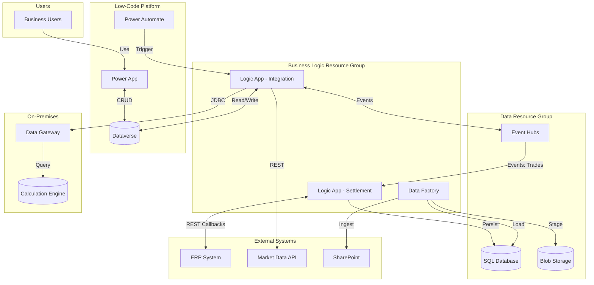

# Energy Trading Settlement Platform

## Overview

The architecture follows a **hybrid cloud pattern** on Microsoft Azure, combining PaaS services for orchestration and data processing with on-premises connectivity for legacy database systems. The design prioritizes security through network isolation (private endpoints, VNet integration), Azure AD-only authentication, and managed identities to eliminate stored credentials in application configurations.

## Architecture Pattern

The solution adopts a **separation pattern between data and business logic**, deployed across two distinct resource groups and subnets. This ensures clear boundaries between the data layer (storage, databases, event streaming) and the application layer (orchestration, integration logic), enabling independent scaling, security policies, and lifecycle management.

## Interactions & Data Flow

### Key Data Flows

1. **Trading Event Ingestion**: Trading platform → Event Hubs → Logic App → SQL Database
2. **ERP Bi-directional Flow**: ERP sends orders via HTTP → Logic App persists and processes → Logic App sends response back via HTTP callback
3. **Market Data Enrichment**: Logic App → External Market Data API → Dataverse (prices for front-end display)
4. **On-Premises Calculation**: Logic App → Data Gateway → Oracle DB → Results back to Dataverse
5. **Document Ingestion**: SharePoint → Data Factory → Blob Storage / SQL Database
6. **Front-End Sync**: Power App ↔ Dataverse ↔ Logic App

## Infrastructure Design

### Environments
The solution runs across **four environments** with identical topology:
- **Development** (dev)
- **Test** (test)
- **Pre-Production** (quality)
- **Production** (prod)

### Network Architecture
- The project VNet provides dedicated subnets following a **hub-spoke topology** — all data services (SQL, Storage) are deployed with **private endpoints** in isolated subnets, with centralized DNS resolution and firewall routing via the hub (UDR routes to hub firewall)
- On-premises connectivity via **On-Premises Data Gateway** for access to the legacy Oracle Database (on-premises calculation engine for commodity models)
- Logic Apps use **VNet integration**
- Data Factory uses **managed private endpoints** for SQL and Blob Storage connections
- Storage is protected both by a **private endpoint** and a **firewall whitelist** — public access is denied, with only specific platform subnets explicitly allowed

### Compute Strategy

The infrastructure is designed for **cost containment** — all resources are configured to pay only for effective usage, with the ability to scale on demand when needed.

- **Serverless SQL Database** (Gen5, 2 vCores) with auto-pause at 60 minutes — zero cost during idle periods
- **Logic Apps Standard** — consumption-based with .NET runtime
- **Data Factory** — pay-per-activity execution

### Resilience
- SQL Database: 35-day point-in-time backup, 12-hour backup intervals
- Storage: **LRS replication** (Locally Redundant Storage) — data is replicated three times within the same datacenter. Cross-region redundancy (GRS) was deliberately excluded because all data can be re-ingested from upstream source systems if needed, making geo-replication an unnecessary cost

## Security Architecture

### Identity & Authentication
- **Azure AD-only authentication** for SQL Server — no SQL username/password authentication permitted
- **Managed Identity** used by Data Factory to access SQL and Blob Storage (SystemAssigned)
- **Service Principals** with scoped permissions per environment
- **Managed Service Identity** for Logic App connections to Dataverse and Event Hubs
- **Bearer token validation** on Logic App HTTP trigger endpoints (ERP-facing)

### Network Security
- All data services behind **private endpoints** (SQL, Blob, Table) — public network access is **disabled** across all services
- **TLS 1.2 minimum** enforced on all connections (industry-standard encryption protocol for data in transit)
- Storage firewall in **Deny** mode with explicit subnet allowlisting as additional layer beyond private endpoints
- **Transparent Data Encryption (TDE)** enabled on SQL Database — automatic encryption of data at rest on disk

### RBAC Model

All role assignments follow the **principle of least privilege** — each identity receives only the minimum permissions required for its specific function, scoped to the narrowest possible resource level.

### Secrets Management
- CI/CD secrets stored as **GitLab CI/CD protected variables** (not in code)
- Logic App connections reference secrets stored in **Azure Key Vault**
- Service principal credentials rotated on 6-24 month cycles per environment

## DevOps & Deployment

### Source Control
- **GitLab** (enterprise self-hosted instance)
- Separate repositories per component:
  - Infrastructure (Terraform)
  - Data Factory (ARM templates)
  - Logic App workflows (per service)
  - SQL scripts (execution pipeline)

### Infrastructure as Code
- **Terraform** for all Azure infrastructure (SQL Server, SQL Database, Storage Account, role assignments, private endpoints)
- Environment-specific variable files with a common base
- GitLab CI pipeline includes corporate IaC Terraform pipeline template

### CI/CD Pipelines

All deployments are automated via **GitLab CI pipelines**, with environment-specific logic, multi-stage workflows (build, SAST security scan, deploy), and branch-based promotion between environments.

| Pipeline | Technology | Strategy |
|----------|-----------|----------|
| Infrastructure | Terraform via GitLab CI | Plan → Apply per environment |
| Data Factory | ARM Templates via GitLab CI | Stop triggers → Deploy → Restart triggers |
| Logic Apps | ZIP deploy via GitLab CI | Pipeline-driven deployment per environment |
| SQL Scripts | GitLab CI (dedicated repo) | Parameterized script execution against SQL Server per environment |

The Data Factory deployment pipeline follows a **safe deployment pattern**: triggers are stopped before ARM template deployment and restarted afterward, preventing partial execution during updates.

### Environment Promotion
- Code is developed in dev, then promoted through **branch-based deployment**:
  - `deployment_test` branch → test environment
  - `deployment_prod` branch → production environment
- Manual gate before production deployments

## Key Design Decisions

| Decision | Options Considered | Choice | Rationale |
|----------|-------------------|--------|-----------|
| SQL Database SKU | Provisioned vs. Serverless | Serverless (Gen5, 2 vCores, auto-pause 60 min) | Intermittent workload from trading hours; significant cost savings during off-hours |
| SQL Authentication | SQL Auth + Azure AD vs. Azure AD only | Azure AD only | Corporate security policy; eliminates password management; aligns with zero-trust |
| Network exposure | Public with firewall vs. Private endpoints | Private endpoints for all data services | Corporate security mandate; defense in depth |
| IaC approach | ARM Templates vs. Terraform | Terraform with enterprise building blocks | Corporate standard; reusable modules; multi-environment support |
| Event ingestion | Direct API polling vs. Event Hubs | Event Hubs | Decouples trading platform from processing logic; handles burst loads; reliable delivery |
| Logic App tier | Consumption vs. Standard | Standard | VNet integration required for private endpoint access; more predictable performance |
| On-premises connectivity | VPN Gateway vs. Data Gateway | On-Premises Data Gateway | Simpler setup for single Oracle DB access; no full VPN required |
| Data Factory role | Central orchestrator vs. File-only | File-only (SharePoint/Blob ingestion) | Logic Apps better suited for real-time event processing; Data Factory for batch file movement |
| Storage redundancy | GRS vs. LRS | LRS | Cost optimization; data can be re-ingested from source systems if needed |

